# Week 5 Assignment

## Task 1: Install MySQL server
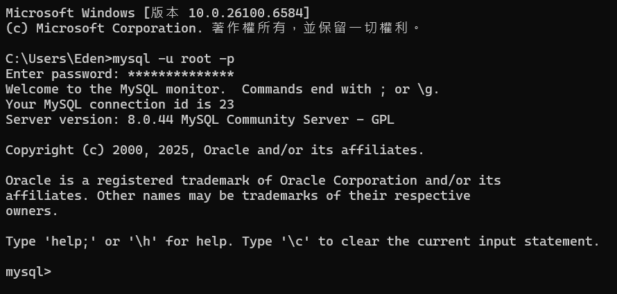

## Task 2: Create database and table in your MySQL server
### Create a new database named website .
```
CREATE DATABASE website;
SHOW DATABASES;
```
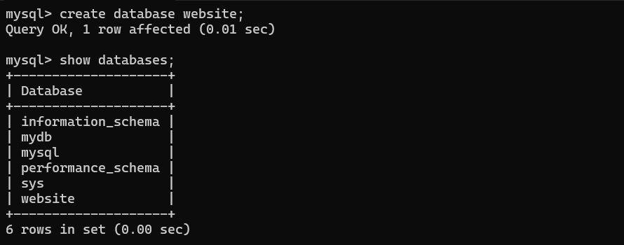

### Create a new table named member , in the website database, designed as below:
```
USE website;
CREATE TABLE member(
	id INT UNSIGNED AUTO_INCREMENT PRIMARY KEY,
	name VARCHAR(255) NOT NULL,
	email VARCHAR(255) NOT NULL,
	password VARCHAR(255) NOT NULL,
	follower_count INT UNSIGNED NOT NULL DEFAULT 0,
	time DATETIME NOT NULL DEFAULT CURRENT_TIMESTAMP
);
```
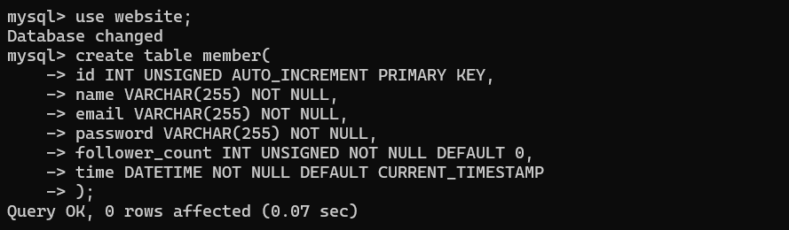

## Task 3: SQL CRUD
### INSERT a new row to the member table where name, email and password must be set to test , test@test.com , and test . INSERT additional 4 rows with arbitrary data.
```
INSERT INTO member(name, email, password)
VALUES ('test', 'test@test.com', 'test');

INSERT INTO member(name, email, password)
VALUES
('test1', 'test1@test.com', 'test1')
('test2', 'test2@test.com', 'test2')
('test3', 'test3@test.com', 'test3')
('test4', 'test4@test.com', 'test4');
```
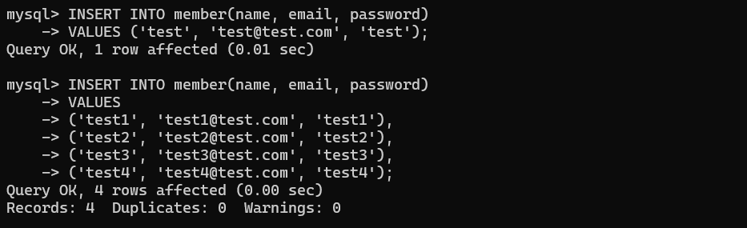

### SELECT all rows from the member table.
```
SELECT * FROM member;
```
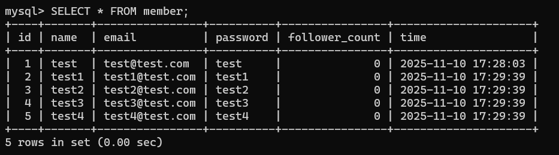

### SELECT all rows from the member table, in descending order of time.
```
SELECT * FROM member
ORDER BY time DESC;
```
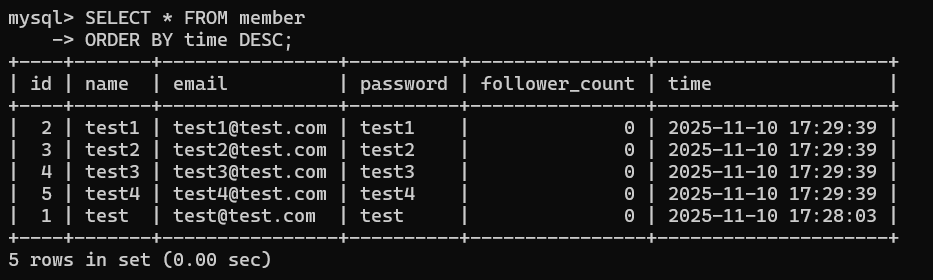

### SELECT total 3 rows, second to fourth, from the member table, in descending order of time. Note: it does not mean SELECT rows where id are 2, 3, or 4.
```
SELECT * FROM member
LIMIT 2,4;
```
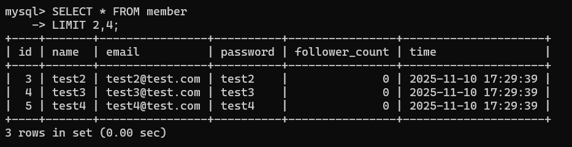

### SELECT rows where email equals to test@test.com .
```
SELECT * FROM member
WHERE email = 'test@test.com';
```
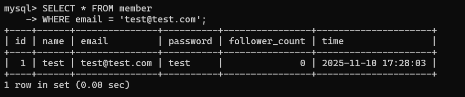

### SELECT rows where name includes the es keyword.
```
SELECT * FROM member
WHERE name like '%es%';
```
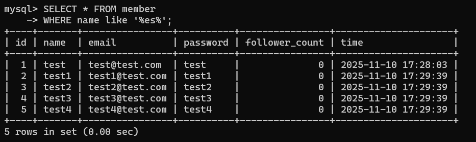

### SELECT rows where email equals to test@test.com and password equals to test.
```
SELECT * FROM member
WHERE email = 'test@test.com'
AND password = 'test';
```
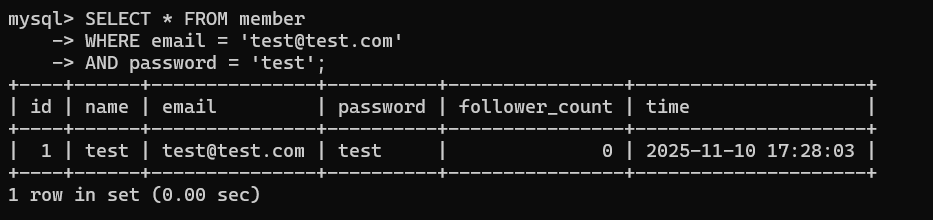

### UPDATE data in name column to test2 where email equals to test@test.com .
```
UPDATE member
SET name = 'test2'
WHERE email = 'test@test.com';
```
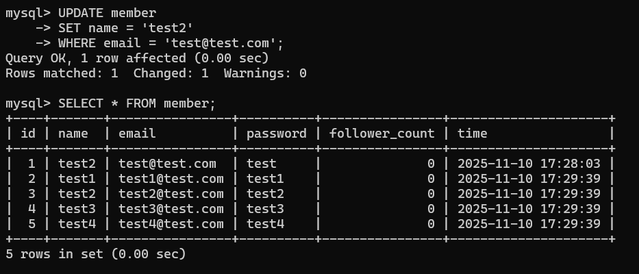

## Task 4: SQL Aggregation Functions
### SELECT how many rows from the member table.
```
SELECT COUNT(*) FROM member;
```
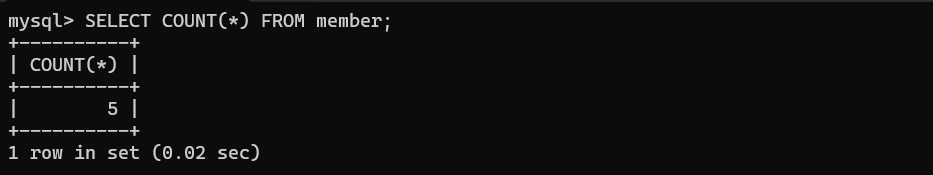

### SELECT the sum of follower_count of all the rows from the member table.
```
SELECT SUM(follower_count) FROM member;
```
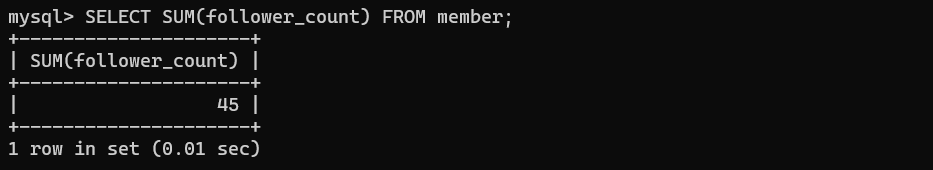

### SELECT the average of follower_count of all the rows from the member table.
```
SELECT AVG(follower_count) FROM member;
```
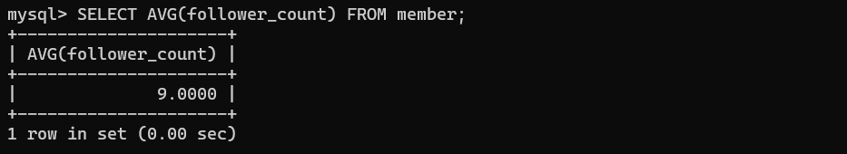

### SELECT the average of follower_count of the first 2 rows, in descending order of follower_count, from the member table.
```
SELECT AVG(follower_count)
FROM(
    SLELCT follower_count
    FROM member
    ORDER BY follower_count DESC
    LIMIT 2
) AS top2;
```
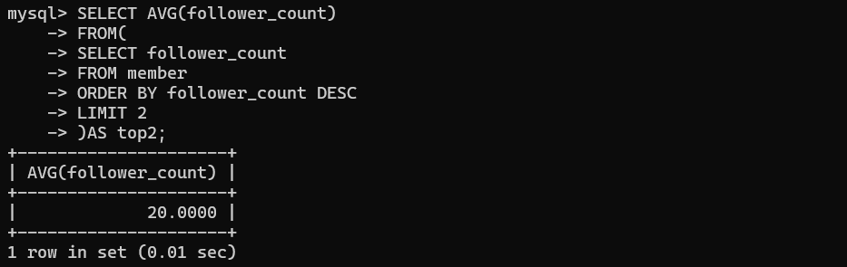

## Task 5: SQL JOIN
### Create a new table named message , in the website database. designed as below:
```
CREATE TABLE message(
	id INT UNSIGNED AUTO_INCREMENT PRIMARY KEY,
	member_id INT UNSIGNED NOT NULL,
    content TEXT NOT NULL,
	like_count INT UNSIGNED NOT NULL DEFAULT 0,
    time DATETIME NOT NULL DEFAULT CURRENT_TIMESTAMP,
    FOREIGN KEY (member_id) REFERENCES member(id)
);
```
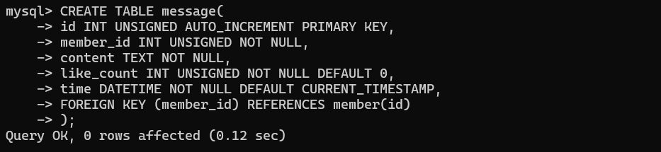

### SELECT all messages, including sender names. We have to JOIN the member table to get that.
```
SELECT message.id, member.name, message.count, message.like_count, message.time
FROM message
JOIN member ON message.member_id = member.id;
```
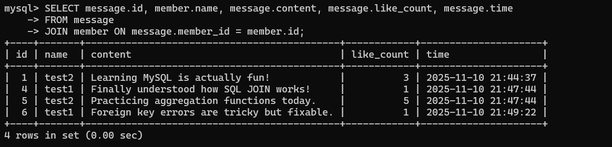

### SELECT all messages, including sender names, where sender email equals to test@test.com . We have to JOIN the member table to filter and get that.
```
SELECT message.id, member.name, member.email, message.content, message.like_count, message.time
FROM message
JOIN member ON message.member_id = member.id
WHERE member.email = 'test@test.com';
```
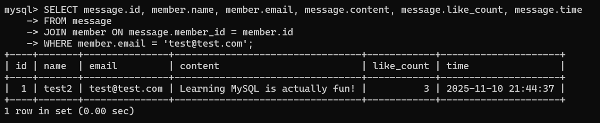

### Use SELECT, SQL Aggregation Functions with JOIN statement, get the average like count of messages where sender email equals to test@test.com .
```
SELECT AVG(message.like_count) AS avg_count
FROM message
JOIN member ON message.member_id = member.id
WHERE member.email = 'test@test.com';
```
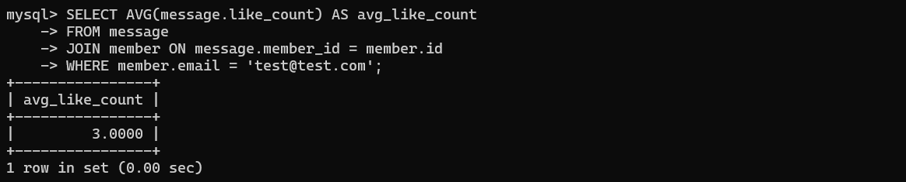

### Use SELECT, SQL Aggregation Functions with JOIN statement, get the average like count of messages GROUP BY sender email.
```
SELECT AVG(like_count)
email FROM message
JOIN member ON message.member_id = member.id
GROPU BY email;
```
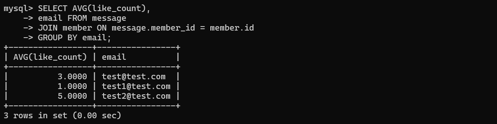
